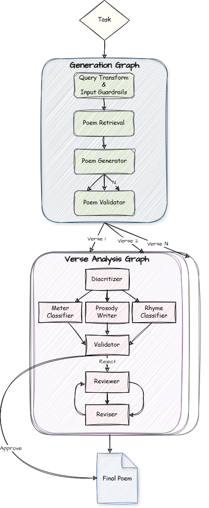

<p align="center">
   <br>
</p>

# Multi-Agent Arabic Poetry Generator and Analyzer

A state-of-the-art multi-agent system developed during the **ALLaM Challenge** hackathon, leveraging the **LangGraph** framework to create and analyze Arabic poetry.

[](LICENSE)
[](https://www.python.org/)

## 🌟 Overview

The ALLaM Challenge, a prestigious competition organized by the **Saudi Federation for Cybersecurity, Programming, and Drones** in collaboration with **SDAIA**, **IBM**, and the **National Technology Development Program**, brought together over 600 participants from 17 countries to advance AI capabilities in Arabic language processing.

### ✨ Key Features
- **Customizable Poetry Generation** with parameters including:
  - Poet name
  - Meter
  - Rhyme
  - Historical era
  - Theme/subject
  - Number of verses

- **Comprehensive Verse Analysis**:
  - Automated diacritization
  - Metrical pattern recognition
  - Rhyme scheme validation
  - In-depth prosodic analysis

## 🏗️ System Architecture
<p align="center">
   <br>
</p>

### Core Workflows

#### 1. PoemGeneratorAgent Workflow
- **Query Transform**: Validates and enhances poem themes in **الفصحى**
- **Poem Retrieval**: Intelligent reference poem matching
- **Poem Generator**: Parallel poem draft creation
- **Poem Evaluator**: Multi-criteria evaluation system

#### 2. VerseAnalysis Workflow
- **Diacritizer**: Fine-tuned Arabic diacritical marking
- **Meter & Rhyme Classification**: Advanced pattern recognition
- **Prosody Analysis**: Comprehensive notation system
- **Reviewer & Reviser Agents**: Iterative refinement process

## 🚀 Getting Started

### Prerequisites
```bash
pip install -r requirements.txt
```

### 1. Data and Model Setup
```python
import gdown
import os
import zipfile

os.makedirs("data", exist_ok=True)
os.makedirs("models/weights", exist_ok=True)

# Download required files
db_url = "https://drive.google.com/uc?id=1DhOVeSca-ytUcIK6IRfoomFBXWzb9rNR"
weights_url = "https://drive.google.com/uc?id=1xUCuayMuxwkxnEEOykMkh-UWhEKbY1jv"

gdown.download(db_url, "data/arabic_poems.db", quiet=False)
gdown.download(weights_url, "models/weights/weights.zip", quiet=False)

# Extract weights
with zipfile.ZipFile("models/weights/weights.zip", "r") as zip_ref:
    zip_ref.extractall("models/weights")

os.remove("models/weights/weights.zip")
print("✅ Setup complete!")
```

### 2. Generate Poetry
```python
from agents import PoemGeneratorAgent
from config import Config
import uuid

config = Config.from_yaml('config.yaml')
agent = PoemGeneratorAgent(config=config)
response = agent.execute(thread_id=str(uuid.uuid4()))

# Display results
for data in response['analyzed_verses_metadata']:
    print(f"{data['validated_verse']['first_hemistich']} - "
          f"{data['validated_verse']['second_hemistich']}\n")
```

## ⚙️ Configuration

### config.yaml Structure
```yaml
task:
  user_preferences:
    poet_name: ""         # Optional poet name
    meter: "الطويل"       # Meter selection
    rhyme: "م"           # Rhyme pattern
    era: "العصر العثماني" # Historical era
    theme: "هجاء"        # Poetry theme (in Arabic)
    num_verses: 4        # Verse count
  num_reference_poems: 3
  num_poems_to_evaluate: 5
  reference_poems: []
  error: {}

operations:
  poem_generator:
    provider: "anthropic"
    name: "claude-3-5-sonnet-latest"
    params:
      temperature: 0.7
      top_p: 0.85
      max_tokens: 500
      stop_sequences: ["[نهاية_القصيدة]"]
```

### Available Options
For the complete list of available options for meter, rhyme, and era, please refer to the options.py file. 

### Supported AI Providers
| Provider | Models | Use Cases |
|----------|--------|-----------|
| Anthropic | Claude series | All operations |
| OpenAI | GPT series | All operations |
| Custom | allam-13b | Poem generation, verse revision |
| Custom | FakeChatModel | Testing and debugging |

## 📝 Important Notes
- The `allam-13b` model requires special access from IBM
- Structured output operations require Anthropic/OpenAI models
- Configure temperature and top_p carefully for optimal results

## 📚 Dependencies and Credits
This project builds upon the following open-source repositories and libraries:
- [LangGraph](https://github.com/langchain-ai/langgraph) - Multi-agent orchestration framework
- [ArabicDiacritizer](https://github.com/zaidalyafeai/Arabic_Diacritization) - For Arabic text diacritization
- [Bohour](https://github.com/ARBML/Bohour) - Arabic poetry rhyme detection and prosody composition
- [AraPoemBERT](https://github.com/FaisalQarah/araPoemBERT/tree/main) - BERT-based Arabic poetry meter classification
<!-- Add other repositories you've used -->

## 🤝 Acknowledgments
Special thanks to our collaborators:
- Saudi Federation for Cybersecurity, Programming, and Drones
- SDAIA
- IBM
- National Technology Development Program
- [harbi](https://github.com/harbi) - Project Contributor

## 📄 License
This project is licensed under the MIT License - see the [LICENSE](LICENSE) file for details.
